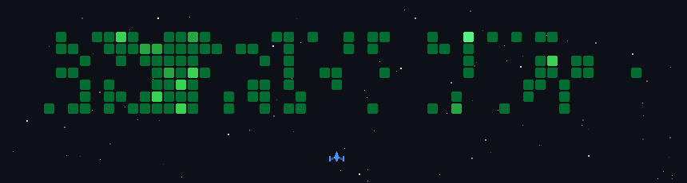

# Hey there! 👋 I'm Merten

**Fullstack Software Engineer at Mercedes-Benz Tech Innovation**

## 🚀 About Me

- 🌐 Experienced in full-stack development with modern web technologies.
- 🎓 Recently completed my Master's degree in Software Engineering.
- 🤖 Developing use case-specific custom generative AI solutions at work.

## 🔧 Technologies

  

  

## 💻 Portfolio

Check out [my portfolio](https://merten.tech) for an overview of my projects and education

## 📊 Stats

  

